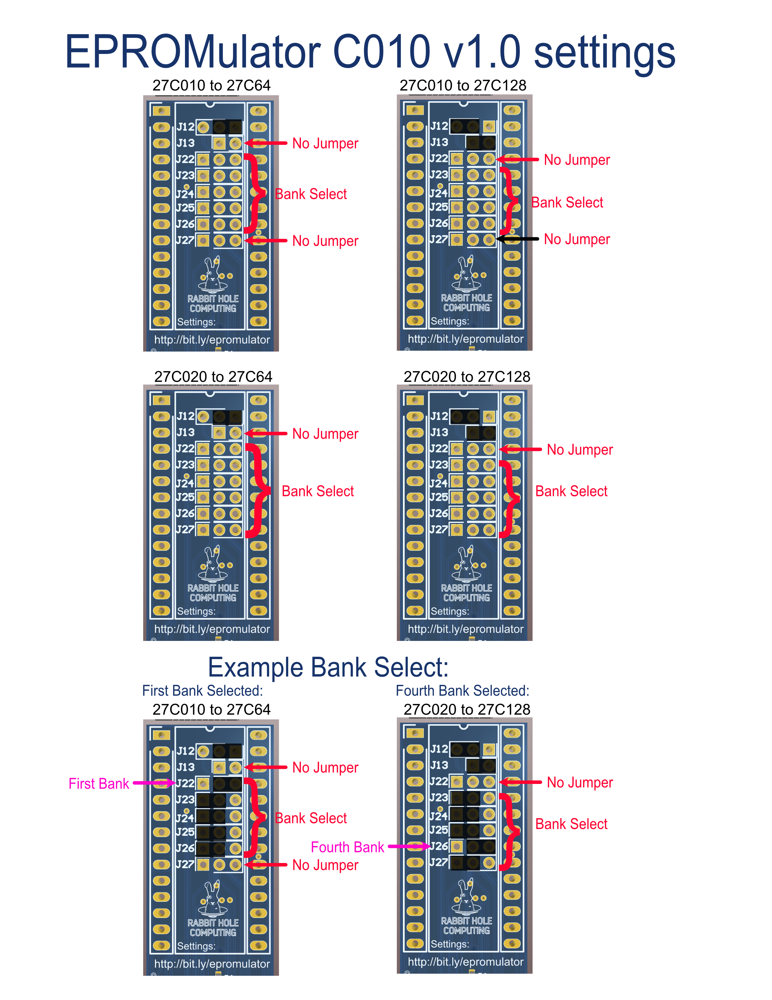

# EPROMulator Settings

### Table of Contents
[EPROMulator v1.0](#epromulator-v1.0)
 - [27C010](#epromulator-v1.0-c010)
 - [27C020](#epromulator-v1.0-c020)
 - [27C040](#epromulator-v1.0-c040)
 - [27C080](#epromulator-v1.0-c080)

[EPROMulator C010 v1.0](#epromulator-C010-v1.0)

## EPROMulator v1.0

#### Setting Files for 27C010:
* [PDF: EPROMulator-v1.0-27C010.pdf](EPROMulator-v1.0/EPROMulator-v1.0-27C010.pdf)
* [PNG: EPROMulator-v1.0-27C010.png](EPROMulator-v1.0/EPROMulator-v1.0-27C010.png)

#### Setting Files for 27C020:
* [PDF: EPROMulator-v1.0-27C020.pdf](EPROMulator-v1.0/EPROMulator-v1.0-27C020.pdf)
* [PNG: EPROMulator-v1.0-27C020.png](EPROMulator-v1.0/EPROMulator-v1.0-27C020.png)

#### Setting Files for 27C040:
* [PDF: EPROMulator-v1.0-27C040.pdf](EPROMulator-v1.0/EPROMulator-v1.0-27C040.pdf)
* [PNG: EPROMulator-v1.0-27C040.png](EPROMulator-v1.0/EPROMulator-v1.0-27C040.png)

#### Setting Files for 27C080:
* [PDF: EPROMulator-v1.0-27C080.pdf](EPROMulator-v1.0/EPROMulator-v1.0-27C080.pdf)
* [PNG: EPROMulator-v1.0-27C080.png](EPROMulator-v1.0/EPROMulator-v1.0-27C080.png)

## EPROMulator C010 v1.0
#### Setting Files:
* [PDF: EPROMulator-C010-v1.0.pdf](EPROMulator-C010-v1.0/EPROMulator-C010-v1.0.pdf)
* [PNG: EPROMulator-C010-v1.0.png](EPROMulator-C010-v1.0/EPROMulator-C010-v1.0.png)

